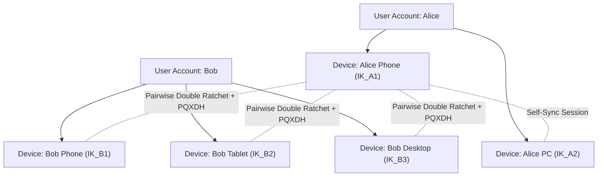

# Signal Sesame Multi-Device Session Management Protocol Specification

## 1. Overview & Architectural Scope

Truples implements the **Signal Sesame Specification Architecture** for asynchronous, multi-device, multi-party session lifecycle management.

In a modern communication system, each user may operate multiple concurrent client endpoints (e.g., Mobile Phone, Desktop PC, Web Browser, Tablet). Traditional 1:1 sessions cannot guarantee privacy if devices share key material or if one compromised device grants access to all user communications.

**Truples Sesame solves this by enforcing a strict 3-tier identity hierarchy and independent pairwise Double Ratchet + Hybrid PQXDH sessions per device.**

---

## 2. 3-Tier Identity & Session Model

1. **User Tier (`UserId`)**: Canonical identity identifier.
2. **Device Tier (`DeviceId`)**: Physical installation holding private key material.
   - Long-Term Device Identity Key ($\text{IK}_{\text{device}}$)
   - Signed Prekey ($\text{SPK}_{\text{device}}$)
   - Post-Quantum Signed Prekey ($\text{PQSPK}_{\text{device}}$)
   - One-Time Prekey Pool ($\text{OPK}_{\text{device}}$, $\text{PQOPK}_{\text{device}}$)
3. **Session Tier (`SessionId = (UserA:DevA, UserB:DevB)`)**:
   - Distinct, isolated `DoubleRatchetSession` state with independent Root Key, Sending Chain Key, Receiving Chain Key, and Ephemeral DH Ratchets.

---

## 3. Protocol Operations & Algorithms

### 3.1 Multi-Device Fan-Out Encryption

When User $A$ on device $D_{A1}$ transmits plaintext $P$ to User $B$:
1. $D_{A1}$ fetches the set of active devices for recipient $B$: $\{ D_{B1}, D_{B2}, \dots, D_{Bn} \}$
2. $D_{A1}$ fetches active sibling self-devices for user $A$: $\{ D_{A2}, \dots, D_{Am} \}$ (excluding $D_{A1}$)
3. For each active target device $D_t$:
   - If an active pairwise session exists: derive message key and encrypt via Double Ratchet.
   - If no active session exists: fetch target PrekeyBundle and initiate via **Hybrid PQXDH**.
4. The transmission encapsulates a map of individual ciphertexts: $\text{devicePayloads}: D_t \mapsto (H_t, \text{IV}_t, C_t)$.

### 3.2 Dynamic Device Addition

- When Bob registers a new device ($D_{B4}$), peers discover the new device registration.
- Alice's next outgoing transmission seamlessly establishes a new PQXDH handshake with $D_{B4}$ without resetting or disturbing existing active sessions with $D_{B1}, D_{B2}, D_{B3}$.

### 3.3 Device Revocation & Stale Device Quarantine

- When a device is marked `REVOKED` (e.g., lost or retired device), all future outgoing fan-outs skip this device immediately.
- Any inbound messages claiming to originate from a revoked device are strictly aborted.
- Unauthorized key changes or anomaly triggers transition the device record to `STALE`, isolating the session from active traffic.

---

## 4. Signal Sesame Specification vs Truples Implementation: Comparison Matrix

| Sesame Requirement | Signal Sesame Specification | Truples Implementation | Status |
| :--- | :--- | :--- | :--- |
| **3-Tier Identity Hierarchy** | User / Device / Pairwise Session | User / Device / Pairwise Session | ✅ **100% Aligned** |
| **Pairwise Key Isolation** | Separate Double Ratchet per device pair | Separate Double Ratchet per device pair | ✅ **100% Aligned** |
| **Initial Key Agreement** | X3DH / PQXDH per device | Hybrid PQXDH (ML-KEM-768 + P-384) per device | ✅ **100% Aligned** |
| **Device Revocation** | Immediate exclusion & session purge | Status `REVOKED` + Session purge | ✅ **100% Aligned** |
| **Compromise Blast Radius** | Isolated to single device | Zero lateral key access across siblings | ✅ **100% Aligned** |
| **Self-Device History Sync** | Sibling device fan-out | Sibling self-device fan-out | ✅ **100% Aligned** |
| **Offline Catch-Up** | Asynchronous skipped-key recovery | Bounded skipped-key recovery + replay cache | ✅ **100% Aligned** |

---

## 5. Security & Invariant Guarantees

1. **Lateral Key Independence**: Possession of private state for Device $D_1$ provides zero mathematical advantage in decrypting ciphertexts destined for Device $D_2$.
2. **Post-Quantum Device Resilience**: Every newly added device establishes an independent Post-Quantum PQXDH boundary.
3. **Rollback & Replay Resistance**: Multi-device session snapshots commit atomically with persistent monotonic counters.
